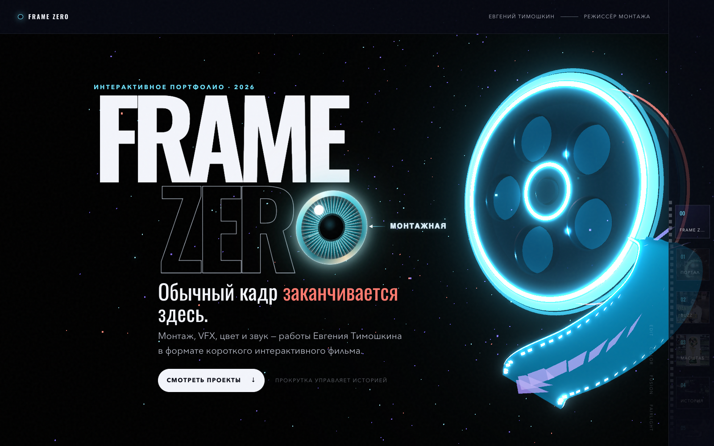

# FRAME ZERO

Учебный одностраничный лендинг для ProfiL School — интерактивное портфолио режиссёра монтажа Евгения Тимошкина.

## Демо

[Открыть опубликованный сайт →](https://kristina-timoshkina.github.io/frame-zero-portfolio/)



## Что реализовано

- одностраничный интерактивный сайт-портфолио;
- адаптивная верстка;
- секции с работами и профессиональной информацией;
- интерактивные элементы и анимации;
- видеоматериалы внутри портфолио;
- отдельная интерактивная монтажная с кейсом фильма «Накладно»;
- SEO-метаданные, Open Graph, JSON-LD, sitemap и правила индексирования;
- публикация через GitHub Pages;
- автоматическая production-сборка через GitHub Actions.
  
## Локальный запуск

```bash
npm install
npm run dev
```

## Production-сборка

```bash
npm run build
npm run preview
```
## Технологии

- Vite
- JavaScript
- CSS
- HTML
- Three.js
- GSAP
- Git / GitHub
- GitHub Pages

  ## О проекте

FRAME ZERO — учебный проект, выполненный в рамках задания Profil School.

Сайт разработан мной как веб-проект с использованием AI-assisted подхода: ChatGPT / Codex использовались как инструменты разработки. Я работала со структурой страницы, компонентами, адаптивностью, визуальной логикой, тестированием и доработкой сайта.

Контент портфолио, видеоработы и профессиональная специализация относятся к Евгению Тимошкину — режиссёру монтажа. Сайт используется как оболочка для представления его работ.

## Публикация на GitHub Pages

После отправки ветки `main` в GitHub workflow `.github/workflows/deploy-pages.yml` автоматически:

1. устанавливает зависимости;
2. собирает production-версию в `dist`;
3. публикует её в GitHub Pages.

В настройках репозитория источник Pages должен быть установлен в **GitHub Actions**.

Исходные ролики из папки `видео лендинг` не публикуются. Для сайта используются отдельные оптимизированные фрагменты в `public/media`.

SEO-аудит и перечень выполненных AI-улучшений находятся в [`docs/seo-audit-2026-10-10.md`](docs/seo-audit-2026-10-10.md).

## Статус

Учебный проект завершён и опубликован на GitHub Pages.

Сайт работает как демонстрационное портфолио. Формы сбора персональных данных и приёма заявок не используются.
